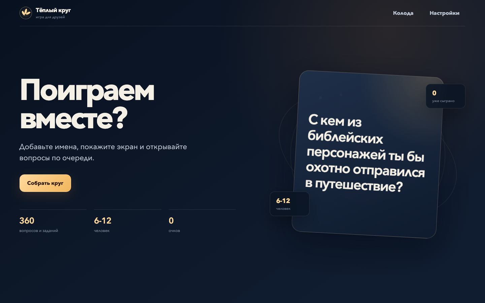
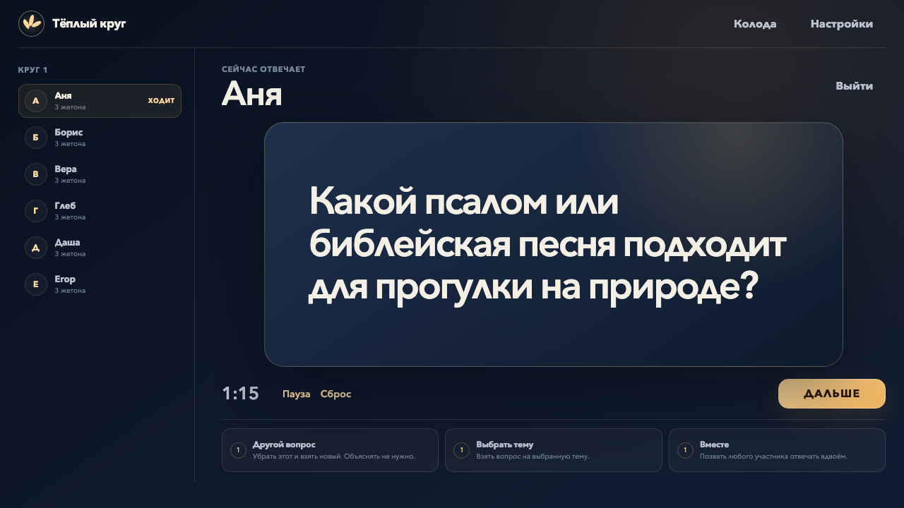

<p align="center">
  
</p>

<h1 align="center">Тёплый круг</h1>

<p align="center">
  <strong>Игра для тёплой встречи в Zoom.</strong><br>
  Ведущий вводит имена, показывает экран и открывает вопросы по очереди.
</p>

<p align="center">
  <a href="https://kiku-jw.github.io/teply-krug/"></a>
  <a href="https://github.com/kiku-jw/teply-krug/actions/workflows/pages.yml"></a>
  <a href="LICENSE"></a>
</p>

<p align="center">
  <a href="https://kiku-jw.github.io/teply-krug/">
    
  </a>
</p>

## Как проходит вечер

1. Ведущий добавляет от 6 до 12 имён в порядке ходов.
2. Все видят один экран через демонстрацию в Zoom.
3. Игрок открывает вопрос, отвечает или использует разовую способность.
4. После полного круга группа решает: продолжить или закончить вечер.

Никаких очков, победителей и рейтингов. Цель игры - хорошо провести время и узнать друг друга.

## Как меняется темп

Первая карточка всегда связана с Библией. Дальше игра сама постепенно переходит от лёгких вопросов к историям, служению и общим заданиям. Участники не видят категорий или уровней и просто играют круг за кругом.

В колоде 360 вручную написанных карточек: о человеке, дружбе, Библии, служении и творческих заданиях. Вопросы не повторяются, пока не закончится подходящая часть колоды.

## Игровой экран

<p align="center">
  
</p>

У каждого участника есть «Другой вопрос» и ещё две случайные возможности: ответить вместе, выбрать один из двух вопросов, спросить весь круг или выбрать тему. Под каждой кнопкой сразу написано, что она делает.

## Сделано для ведущего

- Таймер на 45, 75 или 120 секунд. Он никогда не переключает игрока автоматически.
- Короткие звуки при открытии карточки, новом ходе и окончании времени.
- Анимации можно отключить вместе со звуками в настройках.
- Редактор собственных карточек прямо в браузере.
- Возможность скрыть любую встроенную карточку и позже вернуть её.
- Автоматическое восстановление активной игры после перезагрузки страницы.
- Адаптивный интерфейс для большого Zoom-экрана, ноутбука и телефона.

## Приватность

Это полностью статическое приложение без аккаунтов, сервера и аналитики. Ответы участников нигде не вводятся и не сохраняются. Имена, настройки и пользовательские карточки остаются только в браузере ведущего.

Проект независимый и не является официальным продуктом Свидетелей Иеговы.

## Локальный запуск

Понадобится Node.js 22.

```bash
npm install
npm run dev
```

Полная проверка перед публикацией:

```bash
npm run check
npm exec playwright install chromium
npm run test:e2e
```

Проект собран на Vite и TypeScript без UI-фреймворков. Push в `main` проверяет проект и публикует `dist/` через GitHub Actions.

## Работа с колодой

Встроенные карточки находятся в [`src/content/cards.ts`](src/content/cards.ts). В каждой паре «этап × категория» ровно 24 явно написанных вопроса. Пользовательские карточки проходят проверку на границе `localStorage` и никогда не отправляются в репозиторий.

## Лицензия

Код и оригинальные тексты карточек распространяются по [лицензии MIT](LICENSE).
