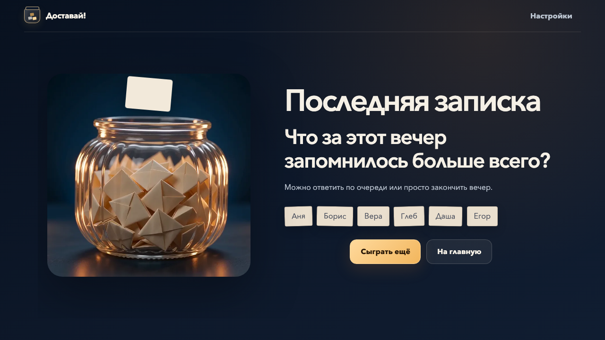

<p align="center">
  
</p>

<h1 align="center">Доставай!</h1>

<p align="center">
  <strong>Банка вопросов для компании в Zoom.</strong><br>
  Один человек вводит имена и показывает экран, а записки тянут по очереди.
</p>

<p align="center">
  <a href="https://kiku-jw.github.io/teply-krug/"></a>
  <a href="https://github.com/kiku-jw/teply-krug/actions/workflows/pages.yml"></a>
  <a href="LICENSE"></a>
</p>

<p align="center">
  <a href="https://kiku-jw.github.io/teply-krug/">
    
  </a>
</p>

## Как проходит вечер

1. Добавьте от 2 до 12 имён в порядке ходов.
2. Выберите примерную длительность: 15 минут, 30 минут или без плана.
3. Все видят один экран через демонстрацию в Zoom.
4. На каждом ходу нажимайте «ВЫТЯНУТЬ» и отвечайте на записку.
5. После полного круга группа решает: продолжить или закончить вечер.

Никаких очков, победителей и рейтингов. Цель игры - хорошо провести время и узнать друг друга.

## Как работает банка

Первую записку игра достаёт с полной анимацией банки. Следующие появляются заметно быстрее, а иногда меняется направление или вылетают дополнительные листки. Вопрос остаётся обычным HTML-текстом, поэтому он чётко выглядит и на большом экране, и на телефоне.

Первый вопрос всегда связан с Библией. Дальше игра постепенно переходит от лёгких тем к историям, служению и общим заданиям. Участники не видят категорий или уровней и просто играют круг за кругом.

В колоде 360 вручную написанных карточек для русскоязычной Zoom-компании, связанной с Украиной: о человеке, дружбе, Библии, служении и творческих заданиях. Вопросы не повторяются, пока не закончится подходящая часть колоды.

## Игровой экран

<p align="center">
  
</p>

На экране остаются только имя, записка, мягкий таймер и кнопка «ДАЛЬШЕ». Если вопрос не подходит, компактное меню позволяет взять другой, ответить вместе или попросить тему. Закончить вечер можно после любой записки.

## Последняя записка

<p align="center">
  
</p>

Вместо сухого экрана результатов игра заканчивается одним общим вопросом. Очков и итоговой оценки нет.

## Для показа в Zoom

- Таймер на 45, 75 или 120 секунд. Он никогда не переключает ход автоматически.
- Шорох бумаги и звон банки при вытягивании, короткие сигналы при новом ходе и окончании времени.
- Первая записка знакомит с банкой, а следующие открываются быстро и тремя разными способами.
- Режимы на 15 и 30 минут предлагают закончить только после полного круга, не обрывая ответ.
- Анимации и звуки можно отключить независимо в настройках.
- Редактор собственных карточек прямо в браузере.
- Возможность скрыть любую встроенную карточку и позже вернуть её.
- Автоматическое восстановление активной игры после перезагрузки страницы.
- Адаптивный интерфейс для большого Zoom-экрана, ноутбука и телефона.

## Приватность

Это полностью статическое приложение без аккаунтов, сервера и аналитики. Ответы нигде не вводятся и не сохраняются. Имена, настройки и пользовательские карточки остаются только в браузере, где запущена игра.

Проект независимый и не является официальным продуктом Свидетелей Иеговы.

## Локальный запуск

Понадобится Node.js 22.

```bash
npm install
npm run dev
```

Полная проверка перед публикацией:

```bash
npm run check
npm exec playwright install chromium
npm run test:e2e
```

Проект собран на Vite и TypeScript без UI-фреймворков. Видео Seedance хранится локально и не вызывает внешний сервис во время игры. Push в `main` проверяет проект и публикует `dist/` через GitHub Actions.

## Работа с колодой

Встроенные карточки находятся в [`src/content/cards.ts`](src/content/cards.ts). В каждой паре «этап × категория» ровно 24 явно написанных вопроса. Правила живой речи, украинского контекста и совместимости с Zoom записаны в [`docs/editorial-guide.md`](docs/editorial-guide.md). Пользовательские карточки проходят проверку на границе `localStorage` и никогда не отправляются в репозиторий.

## Лицензия

Код и оригинальные тексты карточек распространяются по [лицензии MIT](LICENSE).
